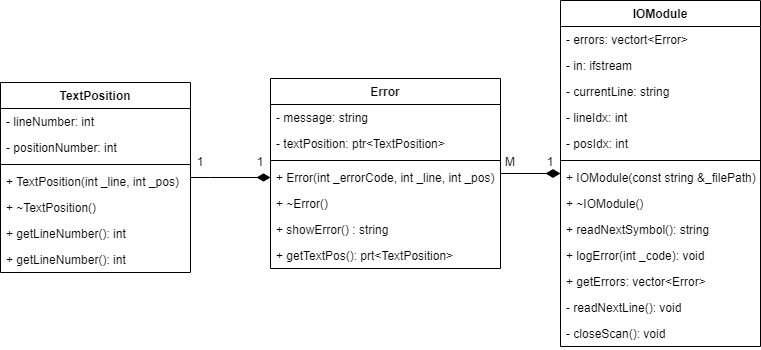

## Модуль ввода-вывода

Модуль ввода-вывода считывает последовательность литер
исходной программы с внешнего устройства и передает их анализатору.

Чтобы напечатать сообщение об ошибке, анализатор должен
передать модулю ввода-вывода причину и местоположение
ошибки. Так как она может встретиться в любом месте исходной программы, анализатору необходимо знать координаты
всех литер во входном потоке. Поэтому модуль ввода-вывода
должен формировать номер строки и номер позиции в строке
для каждой литеры.

Определи класс IOModule, отвчающий за работу модуля ввода-вывода:
```c++
class IOModule {
 private:
  //Список ошибок
  vector<Error> errors;
  //Поток чтения
  ifstream in;
  //Текущая строка
  string currentLine;
  //Индекс строки
  int lineIdx;
  //Индекс позиции в строке
  int posIdx;
  /** Читет следующую строку из потока */
  void readNextLine();
  /** Закрывает поток на чтение */
  void closeScan();
 public:
  explicit IOModule(const string &_filePath);
  ~IOModule();
  /** Читает следуюий символ из строки */
  char readNextSymbol();
  /** Заносит ошибку в список */
  void logError(int _code);
  /** Вовзаращет список ошибок */
  vector<Error> getErrors();
};
```

Чтобы напечатать сообщение об ошибке, анализатор должен
передать модулю ввода-вывода причину и местоположение
ошибки. Так как она может встретиться в любом месте исходной программы, анализатору необходимо знать координаты
всех литер во входном потоке. 

Для этого поередлим класс TextPosition, содержащий данные положения ошибки: номер строки и номер позиции в строке:
```c++
class TextPosition {
 private:
  //Номер строки
  int lineNumber;
  //Номер позиции в строке
  int positionNumber;
 public:
  TextPosition(int _line, int _position);
  virtual ~TextPosition() = default;
  /** Получает номер строки */
  int getLineNumber() const;
  /** Получает номер позиции в строке */
  int getPosNumber() const;
};
```
Для хранения ошибки создадим класс Error, содержащий текст ошибки и ее положение:

```c++
class Error {
 private:
  //Сообщние ошибки
  string message;
  //Позиция ошибки
  shared_ptr<TextPosition> textPosition;
 public:
  Error(int _errorCode, int _line, int _pos);
  ~Error() = default;
  /** Возвращает сообщение ошибки */
  basic_string<char, char_traits<char>, allocator<char>> showError();
  /** Возвращает позицию ошибки */
  shared_ptr<TextPosition> getTextPosition();
};
```

Для инициализации ошибки необходимо передать в констркутор код ошибки(из таблцы кодов, см. далее),
номер строки и номер позиции в строке. В поле message будет занесен текст из таблицы, а также создан объект
shared_ptr класса TextPosition. (shared_ptr гарантирует нам, что TextPosition будет уничтожен вместе с уничтожением родителя. 
Из-за хранения ошибок в векторе модуля unique_ptr использовать не получится, т.к требуется копирование констурктора при инициализации (TextPosition), что unique_ptr делать не позволяет из-за своей уникальности)

```c++
Error::Error(int _errorCode, int _line, int _pos) {
  this->message = errorTable.at(_errorCode);
  this->textPosition = make_unique<TextPosition>(_line, _pos);
}
```

[Таблица ошибок](src/models/codes/ErrorCodes.h) хранится в хешмапе в заголовке Codes.h и позволяет обращется к ней за O(1) по коду для поиска необходимого сообщения.
```c++
const std::map<int, std::string> errorTable = {
    {1, "ошибка в простом типе"},
    {2, "должно идти имя"},
    {3, "должно быть служебное слово PROGRAM"},
    ...}
```
Текст ошибки выводится в следующем формате в методе showMessage:
//TODO Вывод в листинг с кодом
```text
  cout << "Возникла ошибка: " << message
       << ", строка - " << textPosition->getLineNumber()
       << ", позиция - " << textPosition->getPosNumber();
```

