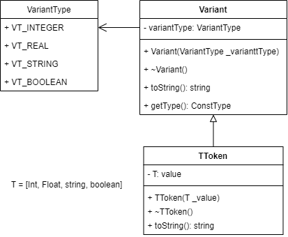

## Лексический анализатор

Лексический анализатор формирует символы исходной программы и строит их внутреннее представление.

Cинтаксический анализатор обращается к сканеру всякий раз, когда потребуется новый символ; в этом случае нет необходимости хранить в памяти всю последовательность символов.

Сканер группирует последовательности литер переменной длины в символы, так как в остальных частях компилятора удобнее
работать с кодами фиксированной длины. В частности, синтаксическому анализатору безразлично, какой идентификатор встречается в каждом конкретном случае. При этом сканер заменяет
конкретное представление каждого символа некоторым кодом;
такие коды символов удобно хранить в виде значений целого
типа.

Будем хранить [коды токенов](/src/models/codes/TokenCode.h) как Enum: <имя токена> - <идентификатор>.

Коды формируются след. образом:
* Для спец.слов -  группируя их по длине имени с идентификатором NM(где N - номер группы, M - номер в группе) 
* Для символов - инкермируя начиная со 100
* Идентификатор и константы 200 и 300 соотвественно
```c++
/** Коды токенов */
enum TokenCode {
  /** Группа 2 */
  ifSy = 20,
  doSy = 21,
  ...,

  /** Группа 3 */
  endSy = 30,
  varSy = 31,
  ...

  /** '*' */
  star = 100,
  /** '/' */
  slash = 101,
  /** '=' */
  equal = 102,
  /** ',' */
  comma = 103,
  ...

  /** Идентификатор */
  ident = 200,

  /** Целочисленая константа */
  intConst = 300,
  /** Вещесвтенная константа */
  realConst = 301,
  /** Строковая константа */
  stringConst = 302,
  /** Булевая константа */
  booleanConst = 303,
};
```

Для преобразования их строкове представление спец. слов заведем мапу keywordMap:
```c++
/** Таблица сключевых слов: <название> - <код токена> */
const map<string, TokenCode> keywordMap = {
    {"do", doSy},
    {"if", ifSy},
    {"in", inSy},
    {"of", ofSy},
    ...
};
```

### Реализация токенов и констант

#### Токены
Реализуем абстрактный класс токена Token.

Токен содержит в себе тип и код. Типы представлны ввиде enum TokenType: идентификатор, ключевое слово, константа.
Код - значение из enum TokenCode. 

Определим также дополнительные методы для доступа к приватным полям и метод toString для возвращения строкового представления токена.

```c++
class Token {
 public:
  /** Типы токенов */
  enum TokenType {
    TT_IDENTIFIER,
    TT_KEYWORD,
    TT_CONSTANT
  };
 private:
  TokenType tokenType;
  TokenCode tokenCode;
 public:
  Token() = default;
  Token(TokenType _tokenType, TokenCode _tokenCode);
  virtual ~Token() = default;
  /** Возвращет строковое значение токена */
  virtual string toString();
  /** Возвращает тип токена */
  TokenType getType();
  /** Возвращает код токена */
  TokenCode getCode();
};
```

Токен идентификатор принимает на вход название идентификатора, тип TT_IDENTIFIER и код TokenCode::ident по умолчанию.

```c++
class IdentifierToken : public Token {
 private:
  string identName;
 public:
  explicit IdentifierToken(string _identName);
  virtual ~IdentifierToken() = default;
};
```

Токен ключевого слова имеет по умолчанию тип TT_KEYWORD и принимает на вход код токена: 

```c++
class KeywordToken : public Token {
 public:
  explicit KeywordToken(TokenCode _tokenCode);
  virtual ~KeywordToken() = default;
};
```

Токен констант по умолчанию имеет тип TT_CONSTANT и имеет 4 вида инстанцирования под каждый из типов: 
целочисленый, вещественный, булевый и строковый. Тип хранится указателем на Variant.

Дополнительно определим методы для получение указателя на Variant константы и строкового значения (В данном случае для получения константы Variant идет обращение к toString указателя на constant)

```c++
class ConstantToken : public Token {
 private:
  shared_ptr<Variant> constant;
 public:
  /** Целочисленная константа */
  explicit ConstantToken(int _value);
  /** Вещественная константа */
  explicit ConstantToken(float _value);
  /** Булева константа */
  explicit ConstantToken(bool _value);
  /** Строковая константа */
  explicit ConstantToken(const string &_value);
  virtual ~ConstantToken() = default;
  /** Возвращает константу */
  shared_ptr<Variant> getConstant();
  /** Возвращет строковое значение константы */
  string toString() override;
};
```

#### Константы (Типы констант)

Для типов (вариантов) константы определим enum VariantType:
```c++
enum VariantType {
  VT_INTEGER,
  VT_REAL,
  VT_STRING,
  VT_BOOLEAN
};
```

Абстрактный класс будет содержать тип и предоставлять методы для получения типа и строкового представления значений:

```c++
class Variant {
 private:
  VariantType variantType;
 public:
  explicit Variant(VariantType _constType);
  virtual ~Variant() = default;
  VariantType getType();
  virtual string toString() = 0;
};
```

Реализация классов Variant идентична для всех типов, например для целочисленной константы:
```c++
class IntVariant : public Variant {
 private:
  int value;
 public:
  explicit IntVariant(int _value);
  virtual ~IntVariant() = default;
  string toString() override;
};
```

### Реализация лексера

Лексер реализуется классом LexAnalyzer. Лексер содержит указатель на модуль ввода-ввыда и единственный публичный метод 
scanNextToken().

Методом scanNextToken() последотвально считываются символы из потока модуля ввода-вывода.
Для сканирования составных символов (блоки, строки, операторы, числа) определены дополнительные методы.
Изанчально проверяются одинарные символы или операторы и спец. символы. Если таких нет, то происходит проверка на число или именование (блок/идентификатор). 
Иначе мы получаем код 6 "Запрещенный символ".

```c++
/**
 * Модуль лексического анализатора
 */
class LexAnalyzer {
 private:
  unique_ptr<IOModule> ioModule;

  /* Максимальное целочисленное значение */
  const int MAX_INT_SIZE = INT_MAX;
  /* Максимальная длина строки */
  const int MAX_STRING_SIZE = 255;
  /* Текущий обрабатываемый символ */
  char currentChar{};

  /* Санирование строк */
  shared_ptr<Token> scanString();
  /* Санирование чисел */
  shared_ptr<Token> scanNumber();
  /* Санирование блоков/идентификаторов */
  shared_ptr<Token> scanBlockName();
 
  /* Санирование символов */
  shared_ptr<Token> scanGreater();
  shared_ptr<Token> scanColon();
  shared_ptr<Token> scanPoint();
  shared_ptr<Token> scanStar();
  shared_ptr<Token> scanLeftPar();
  shared_ptr<Token> scanFlPar();
  shared_ptr<Token> scanFrPar();

 public:
  explicit LexAnalyzer(const string &_filePath);
  ~LexAnalyzer() = default;
  /** Сканирует следующий токен */
  shared_ptr<Token> scanNextToken();
};
```

### Диаграммы классов

##### Токен:

##### Константы (Variant):

##### Анализатор:


### Тестирование
Для теста размера констант зададим специфичиные максимальные размеры.
Проверка целочисленной константы:
```text
const
  year = 2000;
             ^
*** (Код - 203) целая константа превышает предел, строка - 3, позиция - 13
```
Проверка вещественной константы:
```text
const
  year = 6;
  pi = 3.141592;
              ^
*** (Код - 207) слишком большая вещественная константа, строка - 4, позиция - 14
```
Проверка строквой константы:
```text
const
  year = '20255321';
                ^
*** (Код - 76) слишком длинная строковая константа, строка - 3, позиция - 16
```
Запрещенный символ:
```text
const #
       ^
*** (Код - 6) запрещенный символ, строка - 2, позиция - 7
  year = 2022;
```
```text
const
  year = '';
          ^
*** (Код - 75) ошибка в символьной константе, строка - 3, позиция - 10
```

p.s Вроде больше даже у Залоговой не тестировалось. Основная задача - вернуть правильный токен.

Распознование токенов:
Исходник:
```text
program HELLO;
const
  year = 234;
  pi = 3.14;
type
  pInteger = ^integer;
  pReal = ^real;
var
  i, j, k : integer;
  d : real;
  s : string;
  flag : boolean;
  pInt : pInteger;
begin
  j := 1;
  k := 2;
end.
```
Коды:
```text
70 200 104 53 //program HELLO; const
200 //year
102 300 104 200 // = 234; pi
102 301 104 45 // =3.14; type
200 // pInteger.. и т.д
102 107 200 104 200
102 107 200 104 31
200
103 200 103 200 105 200 104 200
105 200 104 200
105 200 104 200
105 200 104 200
105 200 104 50
200
123 300 104 200
123 300 104 30
106 400 
```

Не очень показательно, но если идти и сравнивать построчно каждый токен, то становится понятнее. 
Основная функция лексера по возврату кода токена в данном случае выполнена.