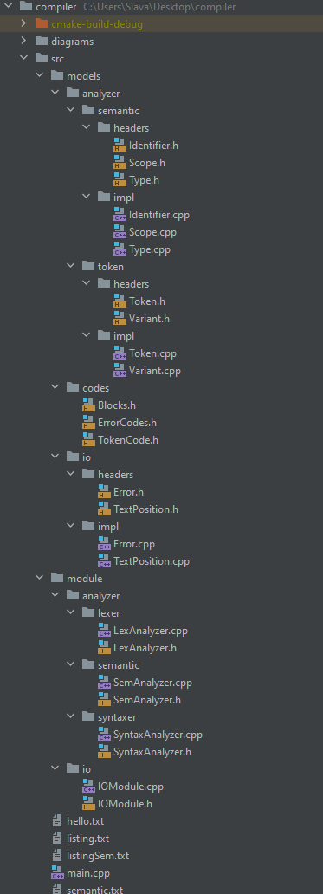

# <h1 align="center">Компилятор</h1>

- [Компилятор](#компилятор-1)
  - [Аналитика, проектирование, тестирование](#аналитика,-проектирование,-тестирование)
  - [Структура проекта](#структура-проекта)

## Аналитика, проектирование, тестирование

Для наглядности все вынесено в отдельные readme:

- ***Модуль ввода вывода*** - [IOMODULE.md](IOMODULE.md)
- ***Лексический анализтор*** - [LEXANALYZER.md](LEXANALYZER.md)
- ***Синтаксический анализтор*** - [SYNTAXANALYZER.md](SYNTAXANALYZER.md)
- ***Семантический анализтор*** - [SEMANTICANALYZER.md](SEMANTICANALYZER.md)

## Структура проекта

***Стуктура:***:
  - **diagrams** - содержит *.png диаграммы классов
  - **src** - исходники
    - ***models*** - содердит модели классов, используемых модулями
        - *semantic* - модели для работы семансера
            - __(Scope, Type, Identifier)__
        - *analyzer* - модели для работы анализторов лексера и синтаксера
            - __(Token, Variant)__
        - *codes* - содержит коды и преобразователи __(Block, ErrorCode, TokenCode)__
        - *io* - модели для работы модуля ввода-вывода __(Error, TextPosition)__
    - ***module*** - содержит основные модули
        - *analyzer* - анализатор
           - *lexer* - лексический анализитор
           - *semantic* - семантический анализатор
           - *syntaxer* - синтаксический анализитор
        - *io* - модуль ввода-вывода

#### Вариант:

12.Раздел описания констант. Ссылочные типы данных. Указатели в выражениях. Оператор выбора (case).

p.s по списку 13, но мы договаривались на 12, т.к в 13 там че-то легаси с рекордами было.

#### Актуальная ветка разработки - [dev](https://github.com/korpatiy/compiler/tree/dev)
