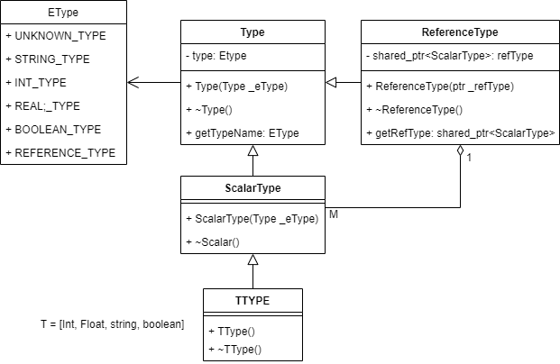
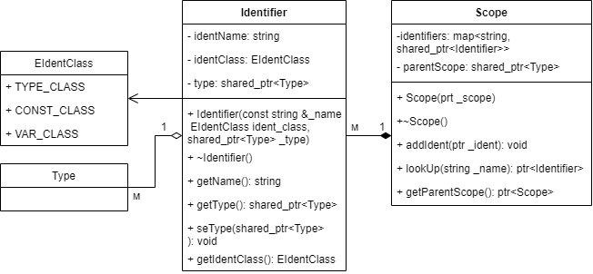
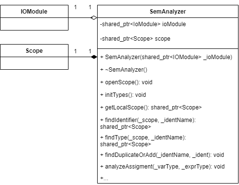

## Семантический анализатор

Формальные правила описания синтаксиса языка программирования (БНФ) служат основой для построения синтаксического
анализатора, однако они дают неполное определение языка.

Язык определяется с помощью формальных и неформальных
описаний. Синтаксические правила языка программирования,которые задаются с помощью естественного языка (неформально), называются контекстными условиями.

Наличие контекстных условий в языке Паскаль связано с
его следующими особенностями:
- Идентификаторы используются для именования различных
конструкций — типов, констант, переменных, процедур,
функций.
- В программах один и тот же идентификатор может использоваться для обозначения различных типов.
- Идентификаторы, описанные в некоторой области действия,
  могут использоваться только в соответствии с описанием
  внутри этой области.
  
Опишем контекстные условия, которым необходимо придерживаться:
1. В любой области действия без внутренних по отношению к ней областей действия никакой идентификатор не может быть описан более одного раза.
2. Каждому прикладному вхождению нестандартного идентификатора (стандартные идентификаторы — integer, boolean,
   real, char, true, false и др.) должно найтись соответствующее ему определяющее вхождение. Алгоритм разберем с опианием метода.
3. Контекстные условия предполагают также проверку
   соответствия типов величин, входящих в синтаксические
   конструкции программ.   

##### Организация сущностей

Проверка контекстных условий требует знания атрибутов
идентификаторов, используемых в программе. Анализатор получает эту информацию из описаний

Способы использования идентификатора представим константами:
```c++
/**
 * Способ использования
 */
enum EIdentClass {
  TYPE_CLASS = 301,
  CONST_CLASS = 302,
  VAR_CLASS = 303,
};
```

Для хранение атрбутов идентификтаора создадим класс Identifier 
с атрибутами **имя идентификатора**, **способ использования** и его **тип**:
```c++
/**
 * Идентификатор
 */
class Identifier {
 private:
  /* Имя идентификатора */
  string identName;
  /* Способ использования */
  EIdentClass identClass;
  /* Тип */
  shared_ptr<Type> type;
 public:
  Identifier(const string &_name, EIdentClass ident_class, shared_ptr<Type> _type);
  ~Identifier() = default;
  /** Возращает имя идентификатора */
  basic_string<char> getName();
  /** Возращает тип идентификатора */
  shared_ptr<Type> getType();
  /** Устанавливает тип идентификатора */
  void setType(shared_ptr<Type> _type);
  /** Возвращает способ использования */
  EIdentClass getIdentClass();
};
```

Как было сказанно в контекстных условиях - идентификтар живет в области.
для этого определим класс Scope, содержащий информацию о **идентификаторах области**, ссылку на объемлющую область.

Определим доп. методы для добаление, поиска идентификатора и возврата родительской области.

```c++
/**
 * Область видимости
 */
class Scope {
 private:
  /* Таблица идентификаторов */
  map<string, shared_ptr<Identifier>> identifiers;
  /* Внешняя по уровню область видимости */
  shared_ptr<Scope> parentScope;
 public:
  explicit Scope(shared_ptr<Scope> _scope);
  ~Scope() = default;

  /** Добавляет переданный идентификтаор [_ident] в таблицу */
  void addIdentifier(const shared_ptr<Identifier> &_ident);
  /** Возвращает идентификатор по имени */
  shared_ptr<Identifier> lookupIdent(const string &_identName);
  /** Возвращет объемлющую область */
  shared_ptr<Scope> getParentScope();
};
```
  
Для работы с типами определим базовы класс Type:
```c++
/**
 * Абстрактный тип
 */
class Type {
 private:
  EType type = UNKNOWN_TYPE;
 public:
  explicit Type(EType e_type);
  ~Type() = default;
  /** Возвращает тип */
  EType getTypeName();
};
```

В рамках работы будем работать с базовыми типами - int, real, string, boolean.
Для индивид. части определим ссылочный тип переменной - reference и для нейтрализации и обработки ошибок - неизвестный тип.
```c++
/**
 * Типы
 */
enum EType {
  UNKNOWN_TYPE,
  INT_TYPE,
  REAL_TYPE,
  STRING_TYPE,
  BOOLEAN_TYPE,
  REFERENCE_TYPE
};
```

Для отеделения базовых скалярных типов опеределим **ScalarType** и его 4 подкаласа - типа:
```c++
/**
 * Скалярный стандартный тип
 */
class ScalarType : public Type {
 public:
  explicit ScalarType(EType e_type);
  ~ScalarType() = default;
};
```

**!(Индивид часть)**
Ссылочный тип наследуюется от базового и содержит ссылкую на скалярный тип (т.к по индивид. части работаем только с базовыми + ссылочным, то сразу будем ссылаться на  скалярный).
```c++
/**
 * Ссылочный тип
 */
class ReferenceType : public Type {
 private:
  /* Ссылка на базовый тип */
  shared_ptr<ScalarType> refType;
 public:
  ReferenceType(shared_ptr<ScalarType> _refType);
  ~ReferenceType() = default;
  /** Возвращает ссылку на базовый тип */
  shared_ptr<ScalarType> getRefType();
};
```

Определим модуль семантичского анализатора.
Он содержит область видимости, в которой находится в данный момент и ссылку на модуль ввода-вывода для логирования ошибок.

```c++
/**
 * Модуль семантического анализтора
 */
class SemAnalyzer {
 private:
  /* Модуль ввода-вывода */
  shared_ptr<IOModule> ioModule;
  /* Область видимости */
  shared_ptr<Scope> scope;

 public:
  explicit SemAnalyzer(shared_ptr<IOModule> _ioModule);
  ~SemAnalyzer() = default;

  /** Открывает область видимости */
  void openScope();
  /** Инициализарует базовые типы */
  void initTypes();

  /** Возвращает текующую область видимости */
  shared_ptr<Scope> getLocalScope();
  /** Ищет идентификатор с именем [_identName] в переданной области [_findScope] */
  shared_ptr<Identifier> findIdentifier(const shared_ptr<Scope> &_findScope, const string &_identName);
  /** Ищет тип по имени идентификатора [_identName] в переданной области [_findScope] */
  shared_ptr<Type> findType(const shared_ptr<Scope> &_findScope, const string &_identName);
  /** Ищет дубиликаты идентфиктаора с имененм [_identName] или добавляет новый в текущую область */
  void findDuplicateOrAddIdentifier(const string &_identName, const shared_ptr<Identifier> &_identifier);

  /* Методы анализа */

  /** Анализ оператора присвания */
  void analyzeAssigment(const shared_ptr<Type>& _varType, const shared_ptr<Type>& _exprType);

  /** Анализ для операции отношения
   * @param _type1 - левый тип
   * @param _type2 - правый тип
   * */
  shared_ptr<Type> analyzeRelations(EType _type1, EType _type2);

  /** Анализ для операции добавления
   * @param _type1 - левый тип
   * @param _type2 - правый тип
   * @param _operation - операция между
   */
  shared_ptr<Type> analyzeAdditive(const shared_ptr<Type>& _type1,
                                   const shared_ptr<Type>& _type2,
                                   TokenCode _operation,
                                   int _tokenSize);

  /** Анализ для операций мультипликации
   * @param _type1 - левый тип
   * @param _type2 - правый тип
   * @param _operation - операция между
   */
  shared_ptr<Type> analyzeMultiplicative(shared_ptr<Type> _type1,
                                         shared_ptr<Type> _type2,
                                         TokenCode _operation,
                                         int _tokenSize);

  /** Анализ для операций численных типов */
  shared_ptr<Type> analyzeNumericTypes(EType _type1, EType _type2);

  /** Проверяет правый терм в выражении или выдает ошибку */
  void checkRightTerm(const shared_ptr<struct Type> &_type);
  /** Возвращает указатель на базовый тип с ссылочного типа */
  EType analyzeRefType(const shared_ptr<Type> &_varType, EType &varTypeName) const;
};
```

Опишем методы для работы анализатора. 
Логика работы семансера и обработка ошибок, относященся только семансеру преимущественна вынесена в его методы.
На уровне синтаксера остается частичная работа с идентификаторами и типами.
Таким образом логика семансера и синтаксера разделена и пересекается минимально.

Работа семансера начинается с инициализации глобальной области видимости, базовых типов и констант (для булеана - true false)
```c++
  /** Открывает область видимости */
  void openScope();
  /** Инициализарует базовые типы */
  void initTypes();
```

Далее определим метод, реализующий алгоритм идентификации по контекстному условию 2:
```c++
  /** Ищет идентификатор с именем [_identName] в переданной области [_findScope] */
  shared_ptr<Identifier> findIdentifier(const shared_ptr<Scope> &_findScope, const string &_identName);
```

1) Смотрим самую внутреннюю область действия,
 содержащую данное прикладное вхождение;
2) Ищем определяющее вхождение (идентификатор). Если найдено, то идентификация закончена.
Вхождение идентификатора удовлетворяет контекстному условию
Иначе рекурсивно поднимаемся по области видимости (шаг 3).
3) Найти область действия, непосредственно объемлющую только
   что рассмотренную. Если такая есть, то переходим к шагу 2.Иначе, если иднетификатора не найдено, то
   вхождение идентификатора не удовлетворяет контекстному условию.
   
К этому определяем дополнительные методы для получения текущей области, определение типа и проверки дубликата идентификатора.

Далее следует раздели проверки контекста выражений и операций:
 - **analyzeAssigment** - для проверки оператора присваивания на соответвсвие типов
 - **analyzeRelations** - проверка операции отношения (>, <, =...)
 - **analyzeAdditive** - проверка аддитивных операций (-, +) и доп. оператора orSy (т.к обработка находится в блоке simpleExpression)
 - **analyzeMultiplicative** - проверка мультпилкативных операций (*, /, div, mod...)
Доп методы для быстрой проверки правого терма в выражении и сравнения численных типов. 

### Диаграммы классов

##### Типы:

##### Идентификатор - область видимости:

##### Анализатор:



### Тестирование

Проверяем повторное описание имени:
```text
const
  value = 234;
  value = 3.14;
             ^
*** (Код - 101) имя описано повторно, строка - 4, позиция - 13
```

Неверное описание имени в типе:
```text
type
  pString = strng;
            ^
*** (Код - 14) имя не описано, строка - 6, позиция - 12
                 ^
*** (Код - 200) должно идти имя, строка - 6, позиция - 17
```

Неверное описание имение в типе (указатель на тип):
```text
type
  pString = string;
  pInteger = ^intfeger;
              ^
*** (Код - 14) имя не описано, строка - 7, позиция - 14
                      ^
*** (Код - 200) должно идти имя, строка - 7, позиция - 22
```

Повторное описание между блоками:
```text
const
  value = 234;
  pi = 3.14;
var
  pi : real;
          ^
*** (Код - 101) имя описано повторно, строка - 10, позиция - 10
```

Неописанное имя:
```text
begin
  i := 5;
  r := pipi;
           ^
*** (Код - 14) имя не описано, строка - 17, позиция - 11
           ^
*** (Код - 401) несоответствие типов, строка - 17, позиция - 11
```

Несоответсвите типов int:
```text
var
  i, j, k : integer;
begin
  i := '321';
            ^
*** (Код - 401) несоответствие типов, строка - 12, позиция - 12
  j := 3.46;
           ^
*** (Код - 401) несоответствие типов, строка - 13, позиция - 11
  k := true;
           ^
*** (Код - 401) несоответствие типов, строка - 14, позиция - 11
```

Несоответсвите типов real:
```text
var
  i, j, k : real;
begin
  i := '321';
            ^
*** (Код - 401) несоответствие типов, строка - 12, позиция - 12
  j := 2;
  k := true;
           ^
*** (Код - 401) несоответствие типов, строка - 14, позиция - 11
```

Несоотсветие типов string:
```text
var
  i, j, k : string;
begin
  i := true;
           ^
*** (Код - 401) несоответствие типов, строка - 12, позиция - 11
  j := '321';
  k := 43;
         ^
*** (Код - 401) несоответствие типов, строка - 14, позиция - 9
```

Несоотвесвтие типов boolean:
```text
var
  i, j, k : boolean;
begin
  i := true;
  j := '321';
            ^
*** (Код - 401) несоответствие типов, строка - 13, позиция - 12
  k := 43;
         ^
*** (Код - 401) несоответствие типов, строка - 14, позиция - 9
```

Операнды в операции +, -:
```text
var
  i, j, k : integer;
begin
  i := 1 + '321';
                ^
*** (Код - 211) недопустимые типы операндов в операции + или -, строка - 16, позиция - 16
                ^
*** (Код - 401) несоответствие типов, строка - 16, позиция - 16
  j := 2 + true;
               ^
*** (Код - 211) недопустимые типы операндов в операции + или -, строка - 17, позиция - 15
               ^
*** (Код - 401) несоответствие типов, строка - 17, позиция - 1
```

Мультпликативные операци:
```text
var
  i, j, k : integer;
begin
  i := 1 * '321';
                 ^
*** (Код - 213) недопустимые типы операндов в операции *, строка - 16, позиция - 17
                ^
*** (Код - 401) несоответствие типов, строка - 16, позиция - 16
  j := 5 mod true;
                  ^
*** (Код - 212) операнды DIV и MOD должны быть целыми, строка - 17, позиция - 18
                 ^
*** (Код - 401) несоответствие типов, строка - 17, позиция - 17
  k := 5 div 2;
end.
```

Операнды and, not, or:
```text
var
  flag1, flag2 : boolean;
begin
  flag1 := flag1 or 'flag2';
                           ^
*** (Код - 210) операнды AND, NOT, OR должны быть булевыми, строка - 16, позиция - 27
                           ^
*** (Код - 401) несоответствие типов, строка - 16, позиция - 27
  flag1 := flag1 and 5;
                      ^
*** (Код - 210) операнды AND, NOT, OR должны быть булевыми, строка - 17, позиция - 22
                      ^
*** (Код - 401) несоответствие типов, строка - 17, позиция - 22
  flag1 := flag1 not 3.14;
                         ^
*** (Код - 210) операнды AND, NOT, OR должны быть булевыми, строка - 18, позиция - 25
                      ^
*** (Код - 401) несоответствие типов, строка - 18, позиция - 25
```

Операция отношения:
```text
begin
  k := 5;
  while (k > '234') do begin
                   ^
*** (Код - 186) несоответствие типов для операции отношения, строка - 17, позиция - 19
                      ^
*** (Код - 401) несоответствие типов, строка - 17, позиция - 22
    k := k + 2;
  end;
  r := pi;
  if (r >= '3.15') then begin
                  ^
*** (Код - 186) несоответствие типов для операции отношения, строка - 21, позиция - 18
                       ^
*** (Код - 401) несоответствие типов, строка - 21, позиция - 23
  end;
end.
```

Неописанное имя, переопределение константы:
```text
begin
  d := 25.6;
  ^
*** (Код - 14) имя не описано, строка - 16, позиция - 2
  pi := 3.15;
    ^
*** (Код - 400) переопределение константы, строка - 17, позиция - 4
end.
```

##### Индивид часть
- ссылочный тип- несоотв. типов:
pInteger - указатель на integer
pInt - перменная сылочного типа
ошибка несоответствия: ожидался pIngteger тип, а пришел integer
```text
type
  pInteger = ^integer;
var
  pInt : pInteger;
  realInt : integer;
begin
  pInt := 5;
         ^
*** (Код - 401) несоответствие типов, строка - 8, позиция - 9
```
верно - указатель на инт ячеку памяти:
```text
type
  pInteger = ^integer;
  pString = ^string
var
  str : pString
  pInt : pInteger;
  realInt : integer;
begin
  pInt^ := 5;
  str^ := '3432';
end.
```

Указатели в выражениях:
Не соотв. типов: pInteger + integer
```text
type
  pInteger = ^integer;
var
  pInt : pInteger;
  realInt : integer;
begin
  pInt^ := 5;
  realInt := pInt + 4;
                   ^
*** (Код - 401) несоответствие типов, строка - 9, позиция - 19
```
Верно через указатель: ^type [операция] type
```text
program HELLO1;
type
  pInteger = ^integer;
var
  pInt : pInteger;
  realInt : integer;
begin
  pInt^ := 5;
  realInt := pInt^ + 4;
  realInt := 5 * pInt^;
  realInt := 5 mod pInt^;
end.
```

Обработка в выражениях:
```text
type
  pInteger = ^integer;
var
  pInt : pInteger;
  realInt : integer;
begin
  pInt^ := 5;
  realInt := pInt^ + '23';
                         ^
*** (Код - 211) недопустимые типы операндов в операции + или -, строка - 9, позиция - 25
                         ^
*** (Код - 401) несоответствие типов, строка - 9, позиция - 25
  realInt := true * pInt^;
                         ^
*** (Код - 213) недопустимые типы операндов в операции *, строка - 10, позиция - 25
                        ^
*** (Код - 401) несоответствие типов, строка - 10, позиция - 24
  realInt := '6542' mod pInt^;
                             ^
*** (Код - 212) операнды DIV и MOD должны быть целыми, строка - 11, позиция - 29
                            ^
*** (Код - 401) несоответствие типов, строка - 11, позиция - 28
end.
```

##### Работа нейтрализатора

Исхолный код:
```text
program HELLO1;
const
  value = 432;
  pi = 3.14;
type
  pInteger = ^integer;
  pString = ^strng;
var
  i, j, k : integer;
  r : real;
  s : string;
  flag : boolean;
  pInt : pInteger;
  realInt : integer;
begin
  d := 5;
  pi := 3.15;

  i := '432'
  s := nos;

  k := 5;
  while (k > '234') do begin
     k := k + 2;
  end;
  r := pi;
  if (r >= '3.15') then begin
  end;

  flag := flag and '321';
  flag := 45 > 44;

  j := j * true;
  j := j * 32;
end.
```

Анализтор:
```text
program HELLO1;
const
  value = 432;
  pi = 3.14;
type
  pInteger = ^integer;
  pString = ^strng;
             ^
*** (Код - 14) имя не описано, строка - 7, позиция - 13
                  ^
*** (Код - 200) должно идти имя, строка - 7, позиция - 18
var
  i, j, k : integer;
  r : real;
  s : string;
  flag : boolean;
  pInt : pInteger;
  realInt : integer;
begin
  d := 5;
  ^
*** (Код - 14) имя не описано, строка - 16, позиция - 2
  pi := 3.15;
    ^
*** (Код - 400) переопределение константы, строка - 17, позиция - 4

  i := '432';
  s := nos;
          ^
*** (Код - 14) имя не описано, строка - 20, позиция - 10
          ^
*** (Код - 401) несоответствие типов, строка - 20, позиция - 10

  k := 5;
  while (k > '234') do begin
                   ^
*** (Код - 186) несоответствие типов для операции отношения, строка - 23, позиция - 19
                      ^
*** (Код - 401) несоответствие типов, строка - 23, позиция - 22
     k := k + 2;
  end;
  r := pi;
  if (r >= '3.15') then begin
                  ^
*** (Код - 186) несоответствие типов для операции отношения, строка - 27, позиция - 18
                       ^
*** (Код - 401) несоответствие типов, строка - 27, позиция - 23
  end;

  flag := flag and '321';
                        ^
*** (Код - 210) операнды AND, NOT, OR должны быть булевыми, строка - 30, позиция - 24
                        ^
*** (Код - 401) несоответствие типов, строка - 30, позиция - 24
  flag := 45 > 44;

  j := j * true;
                ^
*** (Код - 213) недопустимые типы операндов в операции *, строка - 33, позиция - 16
               ^
*** (Код - 401) несоответствие типов, строка - 33, позиция - 15
  j := j * 32;
end.

-----Анализ закончен, кол-во ошибок: 14------
```

p.s есть кривые указатели на позицию в строках, но это погрешности, где надо просто указать свдиги верно.