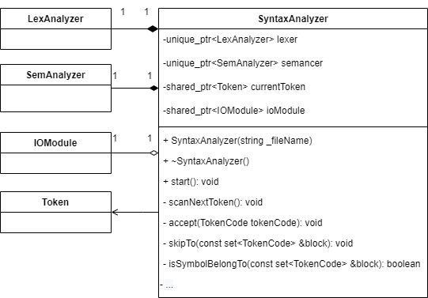

## Синтаксический анализатор

Синтаксический анализатор проверяет удовлетворяет ли исходная программа формальным
правилам описания языка, и определяет синтаксическую
структуру этой программы.

Любая программа, написанная на языке Pascal состоит из заголовка программы и некоторого блока. Блок содержит раздел описаний, в котором определяются все локальные по отношению к данной программе объекты, и раздел операторов. 
Он задает действия, которые необходимо выполнять, над этими объектами.

```text
program имя программы; {заголовок программы}
Const ...; ...; {раздел определения констант}
Type <имя> = <значение>; {раздел описания типов}
Var <список>:<тип>; {раздел описания переменных}
begin  {раздел операторов}
	......;
	......;
end.
```

##### Заголовок
Заголовок всегда начинается со служебного слова program, после которого через пробел пишется имя программы.
Оно может состоять из символов английского алфавита, цифр и знака подчеркивания. Имя программы всегда должно начинаться с буквы.

```text
program one_two_3;
```

##### Раздел описания констант
Константы - это величины, которые не меняют своих значений в процессе выполнения программы.
Начинается данный раздел со служебного слова Const. Далее идут описания констант, каждое из которых начинается с имени константы, затем идет символ = (равенство), после чего пишется константа или выражение, составленное из констант. 
Завершается каждое описание точкой с запятой. 

Константа может иметь только предопределенный (стандартный) тип данных.

```text
Const <имя> = <константа или выражение>;
```

##### Раздел описания типов

Помимо стандартных типов данных в Pascal (Real, Integer, Boolean, Char) пользователь может задать новые типы. Структура раздела описания типов имеет вид:

```text
Type <имя 1=""> = <значение 1="">;
```

##### Раздел описания переменных

еременные отличаются от констант тем, что им можно присваивать новые значения при исполнении программы. Любая переменная, которая будет использована в программе должна быть описана.
Начинается этот раздел с предописанного слова var. Следом идут описания переменных, каждое из которых начинается со списка имен переменных, разделяемых запятыми, затем идет символ : (двоеточие), затем указывается тип этих переменных. Завершается каждое описание точкой с запятой.

```text
Var <список 1="">:<тип 1="">;
``` 

##### Раздел операторов
 
Раздел операторов начинается зарезервированным словом begin (начало), далее следуют операторы языка, отделенные друг от друга точкой с запятой. Завершает раздел зарезервированное слово end. (конец) с точкой.

```text
begin
...
if while case begin 
...
end.
``` 

Когда известна общая структура программы можно ее реализовывать.
Определим модуль-класс SyntaxAnalyzer:

```c++
class SyntaxAnalyzer {
 private:
  /* Лексер */
  unique_ptr<LexAnalyzer> lexer;
  /* Текущий токен */
  shared_ptr<Token> currentToken;

 public:
  explicit SyntaxAnalyzer(const string &_filePath);
  ~SyntaxAnalyzer() = default;

  /** Стартует выполнение анализа */
  void start();
 private:
  /** Сканирует следующий токен */
  void scanNextToken();
  /** Принимает переданный токен и сверяет с текущем */
  void accept(TokenCode tokenCode);
  /** Пропускает до первого встретившегося токена в [block] */
  void skipTo(const set<TokenCode> &block);
  /** Проверяет, пренадлежит ли текущее ключ. слово блоку [block] */
  bool isSymbolBelongTo(const set<TokenCode> &block);
  /**  Проверяет прнадлежность блоку [block] или пропускает до первого встречного, [errorCode] - код ошибки в разделах */
  void isBelongOrSkipTo(const set<enum TokenCode> &block, int errorCode);
  /** Объединяет блоки [first] и [second] */
  set<TokenCode> unionOf(const set<TokenCode> &first, const set<TokenCode> &second);
  /** Добавляет [code] в переданный блок [block] */
  set<TokenCode> unionOf(TokenCode code, const set<TokenCode> &block);

  /* Грамматики */
  /** Обрабтаывает структуру программы */
  void program();
  /** Обрабаытвает раздел описаний */
  void descriptionSection();
  /** Обрабатывает раздел операторов */
  void operatorSection();

  /* !Индивид. часть - Раздел описания констант */
  void constBlock();
  void constDescription();
  void constRecognition(const set<enum TokenCode> &followBlock);

  /* Раздел описания типов */
  void typeBlock();
  void typeDescription();

  /* Раздел описания переменных */
  void varBlock();
  void varDescription();

  /* Распознование типов */
  void typeRecognition();
  void referenceType();
  void simpleType();

  /* Распознование операторов */
  void operatorRecognition(const set<enum TokenCode> &followBlock);
  void compoundOperator(const set<enum TokenCode> &followBlock);
  void assigmentOperator(const set<enum TokenCode> &followBlock);
  void ifOperator(const set<enum TokenCode> &followBlock);
  void whileOperator(const set<enum TokenCode> &followBlock);
  /* !Индивид. часть - оператор выбора case */
  void caseOperator(const set<enum TokenCode> &followBlock);

  /* Разбор перменных и выражений */
  void variable(const set<enum TokenCode> &followBlock);
  void expression(const set<enum TokenCode> &followBlock);
  void simpleExpression(const set<enum TokenCode> &followBlock);

  void term(const set<enum TokenCode> &followBlock);
  void factor(const set<enum TokenCode> &followBlock);
  void caseVariants(const set<enum TokenCode> &followBlock);
};
```

При инстанцировании создается указатель на лексер и передается путь до файла, далее вызывается метод start(),
который в свою очередь начинает распознование. Методом scanNextToken запрашивается следующй токен у Лексера.

Структуру программы обрабаывает метод program():
- Обработка заголовка;
- Обработка раздела описания - descriptionSection();
    - __(!Индивид часть)__ Блок констант - constBlock();
        - Описание констант - constDescription();
            - Распознование констант - constRecognition();
    - Блок типов - typeBlock();
        - Описание типов - typeDescription();
            - Распознование типов - typeRecognition();
                - __(!Индивид часть)__ Ссылочный тип - referenceType();
                - Простой тип - simpleType();
    - Блок перменных - varBlock();
        - Описание перменных - varDescription();
             - -> typeRecognition();
- Обработка раздела операторов - operatorSection();
    - Распознование оператора - operatorRecognition();
        - Составной оператор - compoundOperator();
        - Оператор назначения - assigmentOperator();
            - Разбор выражения - expression();
                - Простое выражение - simpleExpression();
                    - Слагаемое - term();
                        - Множитель - factor();
                            - -> expression();
        - Условный оператор - ifOperator();
            - -> expression();
            - -> operatorRecognition();
        - Оператор цикла с предусловием - whileOperator();
            - -> expression();
            - -> operatorRecognition();
        - __(!Индивид часть)__ Оператор выбора - caseOperator();
            - -> expression();
            - Варианты - caseVariants();
                - -> constRecognition();
                - -> operatorRecognition();
- Точка.

Так выглядит общая реализация обхода в структуре.

Каждая из вызываемых частей (методов) должна проверять находится ли текущий рассмтариваемый токен в своей секции. 
Для этого определим метод __isSymbolBelongTo()__, в который будем передавать токены на текущий блок и сверять его с текущим.

```c++
 /** Проверяет, пренадлежит ли текущее ключ. слово блоку [block] */
  bool isSymbolBelongTo(const set<TokenCode> &block);
```

Как хранить блоки-секции токенов?

Мы можем явно выделить блоки-секции, которые мы ожидаем встретить на том или ином шаге. Например, мы точно знаем, что раздел описаний состоит из констант, перменных и типов, а стандартные типы это - инт, реал, булеан, стринг.
 
Для этого определим заголовочный файл Block.h (используем Set для сохранения уникальности токенов в блоке):
```c++
// Блоки раздела описаний
const set<TokenCode> descriptionBlockSet = set<TokenCode>{constSy, typeSy, varSy};

// Блок стандартных типов кодов
const set<TokenCode> baseTypeCodeSet = set<TokenCode>{intConst, realConst, stringConst, booleanConst};
...

// Операторы сравнения
const set<TokenCode> comparisonOperatorCodeSet =
    set<TokenCode>{TokenCode::equal, laterGreater, later, laterEqual, greaterEqual, TokenCode::greater};
...
```

Дополнительно опеределим методы __unionOf()__ для склеивания блоков или вставки токена в текущий блок:

```c++
  /** Объединяет блоки [first] и [second] */
  set<TokenCode> unionOf(const set<TokenCode> &first, const set<TokenCode> &second);
  /** Добавляет [code] в переданный блок [block] */
  set<TokenCode> unionOf(TokenCode code, const set<TokenCode> &block);
```

#### Нейтрализация ошибок

Анализатор правильно
функционирует только до обнаружения первой синтаксической
ошибки. Если входная последовательность символов содержит
неправильную конструкцию, то анализ программы прекращается.

Дополним анализатор действиями, позволяющими продолжить анализ исходной программы после обнаружения ошибки.
Эти действия называются нейтрализацией ошибки.

Для начала нам необходим метод __accept(TokenCode code)__, который будет сверять ожидаемый токен с текущим и, в случае неудачи, выдавать ошибку.

```c++
  /** Принимает переданный токен и сверяет с текущем */
  void accept(TokenCode tokenCode);
```

(На этом этапе было принято решение назначить кодам ошибок - коды токенов. Таким образом, коды автоматически связаны со своими ошибками и нет необходиомсти распозновать каждый код токена и ошибку для него)

Для того, чтобы нейтрализировать ошибку (пескочить на след. блок) определим метод __skipTo()__ и дополнительный метод для обработки перехода между разделами с передачей ему кода ошибки (например, для раздела операторов 22, для описаний - 18) __isBelongOrSkipTo()__:

```c++
  /** Пропускает до первого встретившегося токена в [block] */
  void skipTo(const set<TokenCode> &block);
  /**  Проверяет прнадлежность блоку [block] или пропускает до первого встречного, [errorCode] - код ошибки в разделах */
  void isBelongOrSkipTo(const set<enum TokenCode> &block, int errorCode);
```

Кроме этого, если в разделе описаний мы практически знаем какие блоки ожидаем дальше, то в разделе операторов это сделать сложнее. Поэтому будем передавать сеты - followBlock для движения по иерархии и возможного перескока.

### Диаграмма классов
В целом не отличается от лексера: содержит уникальный указатель на лексер, использует Token и enum TokenCode.
(Полный список методов уже представлен выше)



### Тестирование
(Полезно было попользоваться онлайн компиляторами типа -  https://www.onlinegdb.com/online_pascal_compiler, чтобы увидеть как на деле обрабатываются ошибки. Помогло с обработкой и нейтрализацией)
Перебраны не все кейсы, но наиболее встречающиеся.

#### Заголовок и раздел описаний
Проверяем, что слово program есть (иначе воспинимается как идентификтаор):
```text
progra HELLO;
^
*** (Код - 70) должно быть служебное слово PROGRAM, строка - 1, позиция - 0
       ^
*** (Код - 104) должен идти символ  ';', строка - 1, позиция - 7
```

Проверяем, что ожидалось имя:
```text
program 2HELLO;
        ^
*** (Код - 200) должно идти имя, строка - 1, позиция - 8
        ^
*** (Код - 104) должен идти символ  ';', строка - 1, позиция - 8
```

Проверяем, что ожидался раздел - const, var, type:
```text
program HELLO;
cons
    ^
*** (Код - 18) ошибка в разделе описаний, строка - 2, позиция - 4
```

Проверяем обработку '=':
```text
const
  year  234;
        ^
*** (Код - 102) должен идти символ  '=', строка - 3, позиция - 8
```

Обработка случайных символов (распознавание как идентификатор в данном случае) :
```text
const
  year = 234;
  pi d= 3.14;
     ^
*** (Код - 102) должен идти символ  '=', строка - 4, позиция - 5
      ^
*** (Код - 104) должен идти символ  ';', строка - 4, позиция - 6
```

Ошибка в имени следующего раздела (распазнается как следующая константа):
```text
const
  year = 234;
  pi = 3.14;
typ
  pInteger = ^integer;
  ^
*** (Код - 102) должен идти символ  '=', строка - 7, позиция - 2
           ^
*** (Код - 104) должен идти символ  ';', строка - 7, позиция - 11
            ^
*** (Код - 18) ошибка в разделе описаний, строка - 7, позиция - 12
```

Проверяем, что тип ссылочный или базовый :
```text
type
  pInteger = ^integer;
  pString = string;
  pReal = :real;
           ^
*** (Код - 10) ошибка в типе, строка - 10, позиция - 11
```

Проверяем, что после объявление перменной следует ":":
```text
var
  i, j, k : integer;
  d  real;
     ^
*** (Код - 105) должен идти символ  ':', строка - 14, позиция - 5
  s : string;
```

Проверяем, что возникает исключение при перечислении перменных :
```text
var
  i, j k : integer;
       ^
*** (Код - 105) должен идти символ  ':', строка - 13, позиция - 7
         ^
*** (Код - 104) должен идти символ  ';', строка - 13, позиция - 9
          ^
*** (Код - 22) ошибка в разделе операторов, строка - 13, позиция - 10
```

Небольшой пример нейтрализации:
```text
program HELLO;
(* раздел констант *)
const
  year  234;
        ^
*** (Код - 102) должен идти символ  '=', строка - 4, позиция - 8
  pi = 3.14;
(* раздел типов *)
type
  pInteger = ^integer
  pString = string;
  ^
*** (Код - 104) должен идти символ  ';', строка - 9, позиция - 2
  pReal = :real;
           ^
*** (Код - 10) ошибка в типе, строка - 10, позиция - 11
(* раздел переменных *)
var
  i, j, k : integer;
  d : real;
  s  string;
     ^
*** (Код - 105) должен идти символ  ':', строка - 15, позиция - 5
  flag : boolean;
  pInt : pInteger
(* раздел операторов *)
begin
^
*** (Код - 104) должен идти символ  ';', строка - 19, позиция - 0
  j := 1;
  k := 2;
end.
```

При этом, если не удалось распознать ожидаемый раздел, то он полностью пропускается до следующего. Например, ожидали "type" после "const", а встретили "typ", то дальнейшее распознование будет пропущено до "var" или "begin".

#### Раздел операторов

Проверяем оператор присваивания :
```text
begin
  i  1;
     ^
*** (Код - 123) должен идти символ  ':=', строка - 20, позиция - 5
  j := 2;
```
Проверяем корректность закрытия скобок :
```text
  r := (4 mod j * 2 + pi;
                        ^
*** (Код - 109) должен идти символ  ')', строка - 23, позиция - 24
```

Проверяем условный оператор - then :
```text
  if (j > i)  begin
              ^
*** (Код - 40) должно идти слово  THEN, строка - 27, позиция - 14
    i := 25;
```

Проверяем условный оператор - then :
```text
  if (i = 25)  (j = 2) then begin
               ^
*** (Код - 40) должно идти слово  THEN, строка - 34, позиция - 15
                ^
*** (Код - 22) ошибка в разделе операторов, строка - 34, позиция - 16
```

Не закрытый begin:
```text
  if (j > i) then begin
    i := 25;
  
  else begin
  ^
*** (Код - 30) должно идти слово  END, строка - 30, позиция - 2
```

Не закрытый begin (отсутствие else):
```text
  if (j > i) then begin
    i := 25;
  end
   begin
   ^
*** (Код - 104) должен идти символ  ';', строка - 30, позиция - 3
```

Цикл с предусловием - do:
```text
 (* цикл с предусловием *)
 flag := true;
 while (flag) begin
              ^
*** (Код - 21) должно идти слово  DO, строка - 36, позиция - 14
```

Оператор выбора отсутсвие ":"":
```text
  (* оператор выбора *)
  case i of
    9  s := 'later ten';
       ^
*** (Код - 105) должен идти символ  ':', строка - 49, позиция - 7
    10 : s := 'ten';
```

Оператор выбора отсутсвие ":=""
```text
 case i of
    8, 9 : s := 'later ten';
    10 : s  'ten';
              ^
*** (Код - 123) должен идти символ  ':=', строка - 50, позиция - 14
```

Оператор выбора отсутсвие "OF""
```text
  case i 
    8, 9 : s := 'later ten';
    ^
*** (Код - 26) должно идти  OF, строка - 49, позиция - 4
```

Оператор выбора ошибка в выражении:
```text
  (* оператор выбора *)
  case  of
        ^
*** (Код - 23) ошибка в выражении, строка - 48, позиция - 8
```

Ожидание точки в конце программы:
```text
begin

end
   ^
*** (Код - 106) должен идти символ  '.', строка - 21, позиция - 3
```

Небольшой пример работы нейтрализатора по всей программе:
```text
program HELLO;
(* раздел констант *)
const
  value = 234
  pi  3.14;
  ^
*** (Код - 104) должен идти символ  ';', строка - 5, позиция - 2
  ^
*** (Код - 102) должен идти символ  '=', строка - 5, позиция - 2
(* раздел типов *)
type
  pInteger = ^integer;
  pString  string;
           ^
*** (Код - 102) должен идти символ  '=', строка - 9, позиция - 11
  pReal = ^real;
(* раздел переменных *)
var
  i, j k : integer;
       ^
*** (Код - 105) должен идти символ  ':', строка - 13, позиция - 7
         ^
*** (Код - 104) должен идти символ  ';', строка - 13, позиция - 9
          ^
*** (Код - 22) ошибка в разделе операторов, строка - 13, позиция - 10
  r : real;
  s : string;
  flag  boolean;
  pInt : pInteger;
(* раздел операторов *)
begin
  i := 1;
  j  2;
     ^
*** (Код - 123) должен идти символ  ':=', строка - 21, позиция - 5
  r := (4 mod j * 2 + pi;
                        ^
*** (Код - 109) должен идти символ  ')', строка - 22, позиция - 24
  s := 'test';
  pInt^ := 25;

  (* условное выражание с составным оператором *)
  if (j > i)  begin
              ^
*** (Код - 40) должно идти слово  THEN, строка - 27, позиция - 14
    i := 25;
  end
   begin
   ^
*** (Код - 104) должен идти символ  ';', строка - 30, позиция - 3
    j := 2;
  end;

  (* неполное условное выражание *)
  if (i = 25) or (j = 2 then begin
                        ^
*** (Код - 109) должен идти символ  ')', строка - 35, позиция - 24
     k := i + j;
  end;

  (* цикл с предусловием *)
  flag := true;
  while (flag)  begin
                ^
*** (Код - 21) должно идти слово  DO, строка - 41, позиция - 16
    i := i + 2;
    if (i >= 10) then
       flag := false;
  end

  (* оператор выбора *)
  case i
  ^
*** (Код - 104) должен идти символ  ';', строка - 48, позиция - 2
    8, 9 : s := 'later ten';
    ^
*** (Код - 26) должно идти  OF, строка - 49, позиция - 4
    10  s := 'ten';
        ^
*** (Код - 105) должен идти символ  ':', строка - 50, позиция - 8
    25 : s := 'more than ten'
  end;
end
   ^
*** (Код - 106) должен идти символ  '.', строка - 53, позиция - 3

-----Анализ закончен, кол-во ошибок: 16-----
```